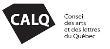

import InstagramPosts from '../../../components/InstagramPosts.astro';

_Décembre 2021_

## Septième résidence Instagram : découvrez l'artiste Myriam Tousignant

Constatant le succès des premières résidences Instagram, Culture Montérégie a décidé de récidiver et d'offrir la possibilité à quatre autres artistes de prendre le contrôle du compte Instagram Culture locale, culture vitale. Pour la septième résidence et première de cette deuxième cohorte, découvrez Myriam Tousignant (Longueuil), artiste multidisciplinaire. Elle mettra en relief sa démarche artistique du 1 au 28 décembre 2021.

Artiste multidisciplinaire qui expérimente avec différents médias, Myriam Tousigant utilise l'impression, la peinture, le dessin et l'installation pour la réalisation de ses œuvres. Elle tend à mélanger autant procédés plus traditionnels que contemporains afin de décloisonner les disciplines. Sa démarche artistique s’est développée autour du genre du portrait.

Rappelons que le jury de la deuxième cohorte de cette résidence artistique inusitée a retenu les propositions de 4 artistes qui auront la possibilité de prendre le contrôle du compte Instagram Culture locale, culture vitale. Il s'agit de Myriam Tousignant (Longueuil) du 1er au 28 décembre 2021, Nadine Descheneaux (Greenfield Park) du 1er au 28 janvier 2022, Marie-Claude De Souza (Longueuil) du 1er au 28 février 2022 et Réal Beaudin (Saint-Antoine-sur-Richelieu) du 1er au 28 mars 2022.

### À propos des résidences Instagram

Durant ce «séjour» d’un mois, les artistes feront découvrir leur démarche artistique de multiples façons : démonstrations vidéo de techniques caractéristiques de leur travail ou de leurs créations en cours d’évolution (comme un journal de bord), publications de performances, d’extraits, de réflexions ou d’explications de leur vision artistique. Ils pourront tout simplement nous faire part de leur quotidien en tant qu’artistes en processus de création par des photos ou des « stories ».

<InstagramPosts/>

